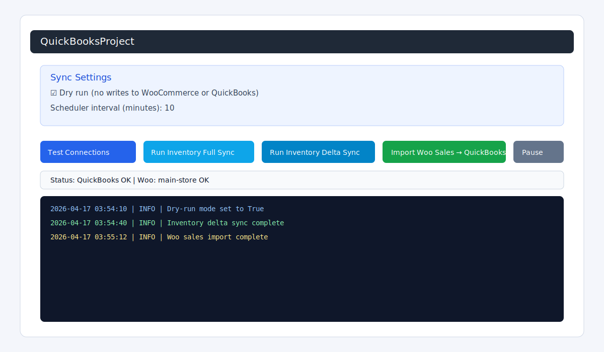
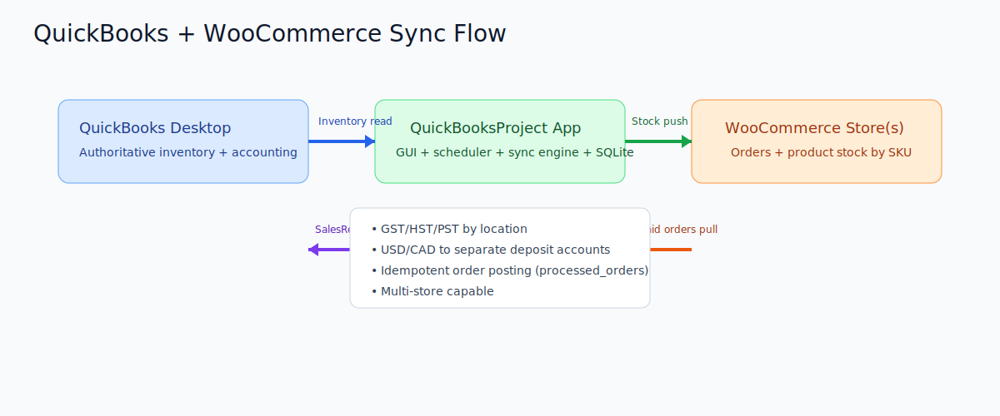

# QuickBooksProject (QuickBooks Desktop ↔ WooCommerce Sync)


- ✅ Pushes QuickBooks inventory to WooCommerce by SKU.
- ✅ Picks tax code (GST / HST / PST) based on order location.
- ✅ Routes USD and CAD sales to different QuickBooks deposit accounts.
- ✅ Supports one or multiple Woo stores.

---

## Screenshots

> Note: These are architecture/UI mock screenshots included with this repo so beginners can understand the app layout quickly.

### Main GUI (dashboard)


### Sync flow overview


---

## 1) Prerequisites (Windows)

You should run this on the same Windows machine that can access the QuickBooks company file.

### Required software
1. **Windows 10/11 Pro** (or Windows Server desktop session).
2. **QuickBooks Desktop Enterprise** installed and licensed.
3. **Python 3.11+** installed (check "Add Python to PATH" during install).
4. A WooCommerce site with REST API access:
   - Consumer Key
   - Consumer Secret
5. A QuickBooks user/session that can authorize SDK access.

### QuickBooks SDK notes
- The app uses `pywin32` + COM (`QBXMLRP2.RequestProcessor`).
- On first use, QuickBooks will prompt to authorize the app. Approve it.
- Keep QuickBooks available during sync runs.
- QB compatibility: the app now tries multiple QBXML versions (13.0 → 12.0 → 11.0 → 10.0 → 8.0) to support more QuickBooks Enterprise releases.

---

## 2) Project structure

```text
quickbooks_project/
  app.py              # app startup wiring
  settings.py         # env settings (stores, tax, currency)
  gui.py              # PySide6 desktop GUI
  sync_engine.py      # inventory push + sales import logic
  qb_adapter.py       # QuickBooks QBXML adapter
  woo_adapter.py      # WooCommerce REST adapter
  db.py               # SQLite schema + run/order tracking
  models.py           # data models
  scheduler.py        # background scheduled jobs
  logging_config.py   # logging setup
requirements.txt
```

---

## 3) Install and run (step-by-step)

From project root:

```powershell
python -m venv .venv
.\.venv\Scripts\Activate.ps1
pip install --upgrade pip
pip install -r requirements.txt
```

Run app:

```powershell
python -m quickbooks_project.app
```

---

## 4) Configuration for beginners

The app uses environment variables through `pydantic-settings`.

## Fastest setup: single store

Set these in your PowerShell session before launching:

```powershell
$env:QB_WOO__APP_NAME = "QuickBooksProject"
$env:QB_WOO__DATABASE_PATH = "state.db"
$env:QB_WOO__LOG_PATH = "sync.log"

$env:QB_WOO__WOO__STORE_NAME = "main-store"
$env:QB_WOO__WOO__BASE_URL = "https://yourstore.com"
$env:QB_WOO__WOO__CONSUMER_KEY = "ck_xxxxxxxxxxxxxxxxx"
$env:QB_WOO__WOO__CONSUMER_SECRET = "cs_xxxxxxxxxxxxxxxxx"
$env:QB_WOO__WOO__VERIFY_TLS = "true"

$env:QB_WOO__SYNC__DRY_RUN = "true"
$env:QB_WOO__SYNC__INTERVAL_MINUTES = "10"
$env:QB_WOO__SYNC__DELTA_MINUTES_LOOKBACK = "60"
$env:QB_WOO__SYNC__ORDER_LOOKBACK_MINUTES = "120"

$env:QB_WOO__TAX__DEFAULT_TAX_CODE = "NON"
$env:QB_WOO__TAX__GST_TAX_CODE = "GST"
$env:QB_WOO__TAX__HST_TAX_CODE = "HST"
$env:QB_WOO__TAX__PST_TAX_CODE = "PST"

$env:QB_WOO__CURRENCY_ACCOUNTS__CAD_DEPOSIT_ACCOUNT = "Undeposited Funds CAD"
$env:QB_WOO__CURRENCY_ACCOUNTS__USD_DEPOSIT_ACCOUNT = "Undeposited Funds USD"
```

Then run:

```powershell
python -m quickbooks_project.app
```

Optional advanced customization via environment variables:

```powershell
$env:QB_WOO__TAX__TAX_RULES = '[{"country":"CA","state":"ON","tax_code":"HST","tax_name":"HST","rate_percent":13.0},{"country":"CA","state":"*","tax_code":"GST","tax_name":"GST","rate_percent":5.0}]'
$env:QB_WOO__CURRENCY_ACCOUNTS__ROUTES = '[{"currency":"CAD","deposit_account":"Undeposited Funds CAD"},{"currency":"USD","deposit_account":"Undeposited Funds USD"}]'
$env:QB_WOO__CURRENCY_ACCOUNTS__DEFAULT_DEPOSIT_ACCOUNT = "Undeposited Funds CAD"
```

## Multi-store setup (future-ready)

Use `QB_WOO__WOO_STORES` as a JSON array:

```powershell
$env:QB_WOO__WOO_STORES = '[
  {
    "store_name": "store-ca",
    "base_url": "https://store-ca.example.com",
    "consumer_key": "ck_xxx",
    "consumer_secret": "cs_xxx",
    "enabled": true
  },
  {
    "store_name": "store-us",
    "base_url": "https://store-us.example.com",
    "consumer_key": "ck_yyy",
    "consumer_secret": "cs_yyy",
    "enabled": true
  }
]'
```

If `WOO_STORES` is present and enabled, it is used. Otherwise the app falls back to single `WOO` settings.

---

## 5) How syncing works

## A) Inventory sync (QuickBooks → Woo)
1. App reads inventory quantities from QuickBooks.
2. For each SKU, app finds Woo product/variation.
3. If quantity differs, updates Woo stock.
4. Logs per-item outcome in SQLite.

This keeps **QuickBooks authoritative**.

## B) Sales import (Woo → QuickBooks)
1. App pulls recent Woo orders with status `processing` or `completed`.
2. Skips orders already processed (idempotency table).
3. Decides tax code by country/province.
4. Decides deposit account by currency (USD/CAD).
5. Posts a QuickBooks Sales Receipt.

Posting Sales Receipts is how inventory is reduced in QuickBooks for inventory-tracked items.

---

## 6) GUI walkthrough

Buttons in the main window:

- **Test Connections**
  - Checks QuickBooks COM connection and each Woo store API connection.
- **Run Inventory Full Sync**
  - Pushes full inventory snapshot from QB to Woo.
- **Run Inventory Delta Sync**
  - Pushes only recently changed QB items.
- **Import Woo Sales → QuickBooks**
  - Pulls orders and posts Sales Receipts in QB.
- **Pause Scheduler**
  - Stops/resumes scheduled background jobs.
- **Settings tab**
  - Explicit fields for Woo API keys, URL, tax codes, deposit accounts, and QBXML versions.
  - Validation highlights invalid fields and shows exactly what to fix.

Use **Dry run** first.

---

## 7) SQLite database files and tables

By default, SQLite is `state.db` with tables:

- `sync_runs` — each sync/import run summary.
- `sync_items` — per-item inventory outcomes.
- `processed_orders` — Woo order idempotency and posting status.
- `sku_map` — optional SKU mapping storage.
- `settings` — optional key/value settings.

---

## 8) Taxes and currency routing

Tax logic is now fully customizable using rule lists (GUI or env settings):

- `tax.default_tax_code` / `tax.default_tax_name` / `tax.default_tax_rate_percent`
- `tax.tax_rules[]` with per-country/per-state rules, each containing:
  - `country`, `state` (`*` supported), `tax_code`, `tax_name`, `rate_percent`

Currency routing is also fully customizable:

- `currency_accounts.default_deposit_account`
- `currency_accounts.routes[]` entries containing:
  - `currency`, `deposit_account`

GUI Settings tab supports editing both via JSON fields with validation errors tied to the exact field.

> Important: Verify tax codes and account names exactly match your QuickBooks company file.

---

## 9) Beginner deployment checklist

1. Start with one Woo store.
2. Turn on `DRY_RUN=true`.
3. Click **Test Connections**.
4. Run **Inventory Full Sync** in dry run and check logs.
5. Run **Import Woo Sales → QuickBooks** in dry run.
6. Validate expected mappings and tax/account behavior.
7. Turn off dry run for live writes.
8. Let scheduler run and monitor `sync.log` + `state.db`.

---

## 10) Troubleshooting

## "No WooCommerce stores configured"
Set either:
- single-store env vars (`QB_WOO__WOO__...`) or
- `QB_WOO__WOO_STORES` JSON.

## QuickBooks COM errors
- Run app under a Windows user with QB access.
- Open QuickBooks and company file once interactively.
- Re-check QuickBooks SDK app authorization.

## Woo API 401/403
- Verify Consumer Key/Secret.
- Ensure REST API permissions include read/write.
- Ensure HTTPS base URL and valid certificate.

## SKU not found
- Ensure Woo SKU and QB SKU use exact same string.
- For variable products, SKU must exist on the variation if syncing variation stock.

---

## 11) Security recommendations

- Use a dedicated Woo API user with least privilege.
- Do not hardcode credentials in source code.
- Rotate API keys regularly.
- Restrict access to `state.db` and `sync.log`.

---

## 12) What to improve next

- Per-store tax rules loaded from config file/database.
- More complete QB item mapping (`ListID` cache and lookup fallback).
- Better GUI settings editor (save/load without env vars).
- Unit tests with adapter mocks.
- Optional webhook-triggered order sync for near-real-time posting.

---

## 13) Quick start command recap

```powershell
python -m venv .venv
.\.venv\Scripts\Activate.ps1
pip install -r requirements.txt
# set QB_WOO__... env vars
python -m quickbooks_project.app
```

---

## 14) Self-hosted / no Intuit services

If you want this fully self-hosted (no Intuit cloud services), see `SELF_HOSTED_DEPLOYMENT.md`.


---

## 15) Modern UX + Operability Improvements

Recent updates added:
- modernized visual styling in the desktop GUI,
- hover help badges (?) for settings labels,
- verbose error dialogs with technical details,
- rotating verbose log files for easier diagnostics.

These improvements align with common strengths seen in well-reviewed open-source inventory tools (strong tracking/auditability, explicit settings, and actionable error feedback).
